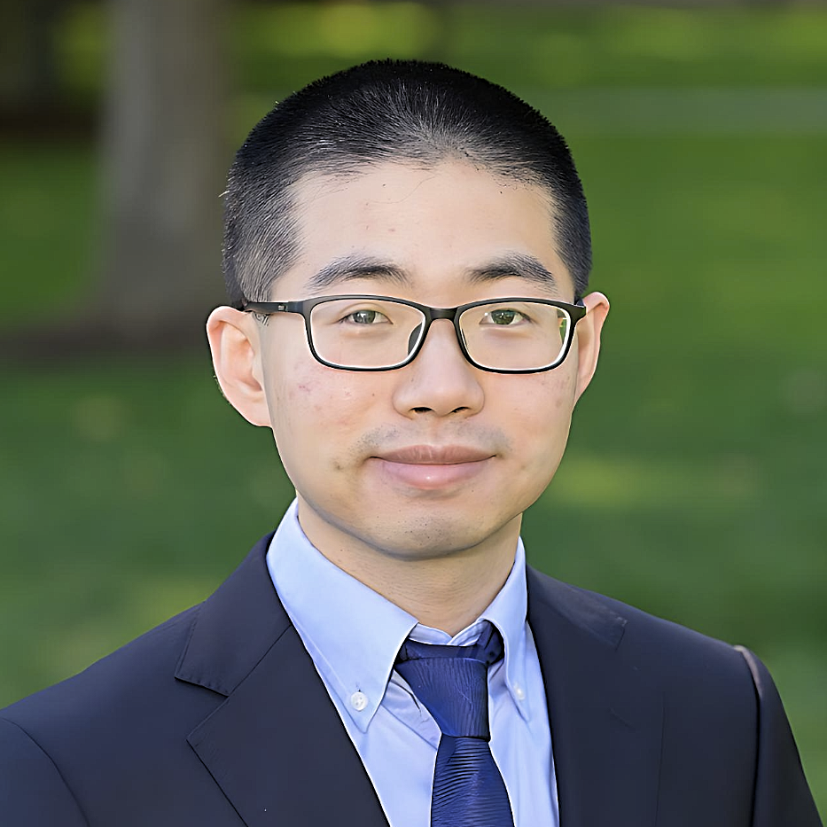

<h1>Dr. Jiale Shi Personal Academic Website</h1>

https://shijiale0609.github.io/

Hi, I'm Jiale Shi.
==================

Biography
---------

I am a Postdoctoral Associate at the Department of Chemical Engineering, Massachusetts Institute of Technology (MIT), under the supervision of [**Prof. Bradley D. Olsen**](https://cheme.mit.edu/profile/bradley-d-olsen/) (MIT) and [**Dr. Debra J. Audus**](https://www.nist.gov/people/debra-audus) (NIST). My postdoc research focuses on utilizing polymer physics, chemical informatics and machine learning to explore the mechanism of polymer systems and accelerate the discovery and design of the next generation of sustainable and functional polymeric materials.

Previously, I did my Ph.D. in Chemical Engineering at the University of Notre Dame with [**Prof. Jonathan K. Whitmer**](https://www3.nd.edu/~jwhitme1/). I utilized molecular simulation, enhanced sampling and machine learning to study the free energy landscapes of materials, and help people understand the mechanisms and design new materials. I received my B.S. in Chemistry at Peking University. I finished my undergraduate thesis on utilizing DFT to study the stability and electric structure of mixed halide perovskite, under the supervision of [**Prof. Hong Jiang**](https://www.chem.pku.edu.cn/en/faculty/researchareas/physical/86784.htm).

Awards & Honors
---------------

*   2023\. ACS Polymeric Materials Science and Engineering (PMSE) Future Faculty Scholar.
*   2023\. NIST Postdoctoral & Early-career Association of Researchers (PEAR) Accolades Outstanding Technical Finalist.
*   2023\. Big Data Award at ACS Fall 2023 Big Data in Polymer Chemistry session.
*   2023\. Selected Attendees of ACS Postdoc to Faculty Workshop.
*   2023\. Selected Attendees of Soft Matter Future Faculty Workshop.
*   2023\. Winner, MIT ChemE Teach-Off 2023 Competition.
*   2023\. Forum for Early Career Scientists (FECS) Travel grant, APS March 2023 Meeting.
*   2020\. Graduate School’s Professional Development Award, University of Notre Dame.
*   2020\. Graduate Student Union Conference Presentation Grant, University of Notre Dame.
*   2020\. DSOFT Travel Grant, APS March 2020 Meeting.
*   2020\. Outstanding Paper Award, Department of Chemical and Biomolecular Engineering, University of Notre Dame.
*   2019\. Graduate School’s Professional Development Award, University of Notre Dame.
*   2019\. Graduate Student Union Conference Presentation Grant, University of Notre Dame.
*   2019\. Best Poster Award, 6th Annual Notre Dame-Purdue Soft Matter & Polymers Symposium.
*   2016\. Cryrus Tang CaringHeart Scholarship, Peking University.
*   2015\. Cryrus Tang CaringHeart Scholarship, Peking University.
*   2014\. Cryrus Tang CaringHeart Scholarship, Peking University.
*   2014\. National Endeavor Fellowship, Peking University.
*   2013\. Cryrus Tang CaringHeart Scholarship, Peking University.
*   2012\. 2nd Prize in the China’s National Olympic Chemistry Competition.

Education
---------

*   **Ph.D.** in Chemical Engineering  
    Thesis: [**Computing Free Energy Landscapes for Materials Design**](https://www.proquest.com/openview/68cbb71cb224b520a8d32a2cc4a8e3de/1?pq-origsite=gscholar&cbl=18750&diss=y)  
    Advisor: [**Prof. Jonathan K. Whitmer**](https://www3.nd.edu/~jwhitme1/)  
    Minor in Computer Science  
    University of Notre Dame, July. 2017 -- May. 2022  
      
    
*   **Master** in Chemical Engineering  
    University of Notre Dame, July. 2017 -- May. 2020  
      
    
*   **B.S.** in Chemistry  
    Advisor: [**Prof. Hong Jiang**](https://www.chem.pku.edu.cn/en/faculty/researchareas/physical/86784.htm)  
    Peking University, Sep. 2013 -- Jul. 2017  
      
    

Publications
------------

\[[**Google Scholar**](https://scholar.google.com/citations?user=GL5CycwAAAAJ&hl=en&authuser=1)\]

1.  **Jiale Shi**, Dylan Walsh, Nathan J. Rebello, Weizhong Zou, Michael E. Deagen, Katharina A. Fransen, Xian Gao, Bradley D. Olsen, Debra J. Audus. Calculating Pairwise Similarity of Polymer Ensemble via Earth Mover’s Distance. ACS Polymers Au. 2024 ASAP. \[[**Link**](https://doi.org/10.1021/acspolymersau.3c00029)\] \[[PDF](Publication/shi-2024-EMD.pdf)\]
  
3.  **Jiale Shi**, Debra J. Audus, Bradley D. Olsen. Graph Neural Network for Efficient and Accurate Macromolecular Similarity Calculation. In preparation.
  
5.  Nathan J. Rebello, Akash Arora, Hidenobu Mochigase, Tzyy-Shyang Lin, Debra J. Audus, **Jiale Shi**, Eric. S. Muckley, and Bradley D. Olsen. BCDB: The Block Copolymer Phase Behavior Database. J. Chem. Inf. Model. In revision.
  
7.  **Jiale Shi**, Nathan J. Rebello, Dylan Walsh, Weizhong Zou, Michael Deagen, Bruno Salomao Leao, Debra J. Audus, Bradley D. Olsen. Quantifying Pairwise Similarity for Complex Polymers. Macromolecules. 2023, 56, 18, 7344–7357 \[[Publisher](https://doi.org/10.1021/acs.macromol.3c00761)\] \[[PDF](Publication/shi-2023-PolymerSimilarity.pdf)\]
  
9.  Kevin Maik Jablonka,...,**Jiale Shi**,... 14 Examples of How LLMs Can Transform Materials Science and Chemistry: A Reflection on a Large Language Model Hackathon. Digital Discovery. 2023.\[[Publisher](https://doi.org/10.1039/D3DD00113J)\]
  
11.  **Jiale Shi**, Fahed Albreiki, Yamil J. Colón, Samanvaya Srivastava, Jonathan K. Whitmer. Using Transfer Learning to Leverage Prior Knowledge in the Prediction of Adhesive Free Energies between Polymers and Surfaces. _J. Chem. Theory Comput._ , 2023, 19, 14, 4631–4640 \[[Publisher](https://pubs.acs.org/doi/10.1021/acs.jctc.2c01314)\] \[[PDF](Publication/acs.jctc.2c01314.pdf)\]
  
13.  **Jiale Shi**, Michael J. Quevillon, Pedro H. Amorim Valença, and Jonathan K. Whitmer. Predicting Adhesion Free Energies of Polymer-Surface Interactions with Machine Learning. _ACS Appl. Mater. Interfaces_ , 2022, 14, 32, 37161-37169 \[[Publisher](https://pubs.acs.org/doi/10.1021/acsami.2c08891)\] \[[PDF](Publication/Jiale_Shi_2022_AMI_ML_PSI.pdf)\]  
    
  
15.  **Jiale Shi**, Shanghui Huang, François Gygi, and Jonathan K. Whitmer. Free-Energy Landscape and Isomerization Rates of Au4 Clusters at Finite Temperatures. _J. Phys. Chem. A_ , 2022, 126, 21, 3392-3400 \[[Publisher](https://pubs.acs.org/doi/full/10.1021/acs.jpca.2c02732)\] \[[PDF](Publication/Jiale_Shi_2022_JPCA_Au.pdf)\]
  
17.  **Jiale Shi\***, Hythem Sidky\*, Jonathan K. Whitmer. Automated determination of n-cyanobiphenyl and n-cyanobiphenyl binary mixtures elastic constants in the nematic phase from molecular simulation. _Mol. Syst. Des. Eng._ 2020, 5, 1131-1136. \[[Publisher](https://pubs.rsc.org/en/content/articlehtml/2020/me/c9me00065h)\] \[[PDF](Publication/Jiale_Shi_2020_MSDE_nCB.pdf)\] (\* indicates equal contribution and co-first authorship)
  
19.  **Jiale Shi**, Hythem Sidky, Jonathan K. Whitmer. Novel elastic response in twist-bend nematic models. _Soft Matter_ 2019, 15(41), 8219-8226. \[[Publisher](https://pubs.rsc.org/en/content/articlehtml/2019/sm/c9sm01395d)\] \[[PDF](Publication/Jiale_Shi_2019_SoftMatter_tblc.pdf)\] (**inside front cover**)

Experiences
-----------

  

*   Apr. 2022 -- Present. **Postdoctoral Associate**. Department of Chemical Engineering, Massachusetts Institute of Technology (MIT), Cambridge, MA, United States  
    Advisor: [**Prof. Bradley D. Olsen**](https://cheme.mit.edu/profile/bradley-d-olsen/) (MIT) and [**Dr. Debra J. Audus**](https://www.nist.gov/people/debra-audus) (NIST)  
      
    
*   Nov. 2017 -- Jan. 2022. **Ph.D. Research Assistant**. Department of Chemical and Biomolecular Engineering, University of Notre Dame, South Bend, IN, United States  
    Advisor: [**Prof. Jonathan K. Whitmer**](https://www3.nd.edu/~jwhitme1/)  
      
    
*   Sept. 2016 -- June. 2017. **Undergraduate Research Assistant**. College of Chemistry and Molecular Engineering, Peking University, Beijing, China  
    Advisor: [**Prof. Hong Jiang**](https://www.chem.pku.edu.cn/en/faculty/researchareas/physical/86784.htm)  
      
    

Presentations
-------------

  

### Oral Presentations

1.  ACS Fall 2023, San Francisco, CA, Quantifying pairwise chemical similarity of polymers, August 2023.
2.  ACS Fall 2023, San Francisco, CA, Earth mover’s distance as a metric for calculating pairwise similarity of polymer ensembles, August 2023. (Invited Talk)
3.  APS March Meeting 2023, Las Vegas, NV, Qualifying Pairwise Chemical Similarity of Polymers. March 2023.
4.  33rd IUPAP Conference on Computational Physics (Virtual), Free-Energy Landscape and Isomerization Rates of Au4 Clusters at Finite Temperatures, August 2022.
5.  2021 AIChE Annual Meeting, Predicting Adhesive Free Energies of Polymer-Surface Interactions with Machine Learning, Boston, November 2021.
6.  APS March Meeting 2022, Using Transfer Learning to Leverage Prior Knowledge in the Prediction of Adhesive Free Energies between Polymers and Surfaces, March 2022.
7.  Invited Seminar Talk, Predicting Adhesive Free Energies of Polymer-Surface Interactions via Machine Learning and Transfer Learning, MIT-NIST Joint-Postdoc Application Interview, Sept 2021.
8.  Virtual Polymer Physics Symposium 2021 sponsored by American Physical Society, Division of Polymer Physics, Predicting Adhesive Free Energies of Polymer-Surface Interactions with Machine Learning, August 2021.
9.  Geometry and Topology meet Data Analysis and Machine Learning (GTDAML 2021), Predicting Adhesive Free Energies of Polymer-Surface Interactions with Machine Learning, July 2021.
10.  IDEA SLAM, Soft Matter Far From Equilibrium – CHESS 2030 Workshop, Predicting Adhesive Free Energies of Polymer-Surface Interactions with Machine Learning, June 2021.
11.  ACS Spring Meeting 2021 (Online), Predicting Adhesive Free Energies of Polymer-Surface Interactions with Machine Learning, April 2021.
12.  APS March Meeting 2021(Online), Free energy landscapes and transition rates of dynamic properties of Au4 neutral and charged clusters at finite temperature, March 2021.
13.  Novel elastic response in twist-bend nematic models, Invited Talk on Department Seminar 2020 Fall, Department of Chemical and Biomolecular Engineering, University of Notre Dame Oct 2020. **Outstanding Paper Award**.
14.  APS March Meeting 2020, Denver, CO (moved to Online), Phase behavior and elastic response of liquid crystal mixtures in atomistic models, March 2020.
15.  17th International Conference on Ferroelectric Liquid Crystals, Boulder, CO, Novel Elastic Response in Twist-bend Nematic Models, August 2019.
16.  2019 Midwest Thermodynamics and Statistical Mechanics Conference (MTSM), Urbana, IL, Novel Elastic Response in Twist-bend Nematic Models, June 2019.
17.  APS March Meeting 2019, Boston, MA, Twist-bend-like phases and elastic response of model bent-core liquid crystals, March 2019.
18.  CoMSEL supergroup meeting, Notre Dame, IN, Twist-bend-like phases and elastic response of model bent-core liquid crystals, Feb 2019.

  

### Poster Presentations

1.  APS March Meeting 2023, Las Vegas, NV, Pairwise Similarity of Polymer Ensembles. March 2023.
2.  6th Annual Notre Dame-Purdue Soft Matter & Polymers Symposium, West Lafayette, IN, Novel Elastic Response in Twist-bend Nematic Models, September 2019. **Best Poster Award**.
3.  5th Annual Chemical & Biomolecular Engineering Graduate Research Symposium, Notre Dame, IN, Novel Elastic Response in Twist-bend Nematic Models, September 2019.
4.  51st Midwest Theoretical Chemistry Conference (MWTCC), Notre Dame, IN, Novel Elastic Response in Twist-bend Nematic Models, June 2019.
5.  5th Annual Notre Dame-Purdue Soft Matter & Polymers Symposium, Notre Dame, IN, Phase Behavior and Elasticity of Polar Liquid Crystals, October 2018.
6.  4th Annual Chemical & Biomolecular Engineering Graduate Research Symposium, Notre Dame, IN, Phase Behavior and Elasticity of Polar Liquid Crystals, September 2018.

Leadership & Professional Service
---------------------------------

  

*   Aug. 2023. Poster Judge, ACS Fall 2023.
*   Jun. 2023. Volunteer, ChemE Pride Picnic, MIT.
*   Mar. 2023. Session Chair, APS March Meeting 2023
*   Sept. 2022 -- Present. **Postdoc Representative at ChemE Diversity, Equity, and Inclusion (D&I) Committee** .  
    Department of Chemical Engineering, Massachusetts Institute of Technology (MIT), Cambridge, MA, United States  
    
*   Sept. 2022 -- Present. **ChemE Postdoc Advisory Board Leads**.  
    Department of Chemical Engineering, Massachusetts Institute of Technology (MIT), Cambridge, MA, United States  
    
*   Sept. 2018 -- May. 2019. **CBE Graduate Student Representative at Notre Dame Graduate Student Union (GSU)** .  
    Department of Chemical and Biomolecular Engineering, University of Notre Dame, Notre Dame, IN, United States  
    
*   Sept. 2017 -- April. 2019. **Social Chair at Chemical and Biomolecular Engineering Graduate Student Organization(CBEGSO)**.  
    Department of Chemical and Biomolecular Engineering, University of Notre Dame, Notre Dame, IN, United States  

